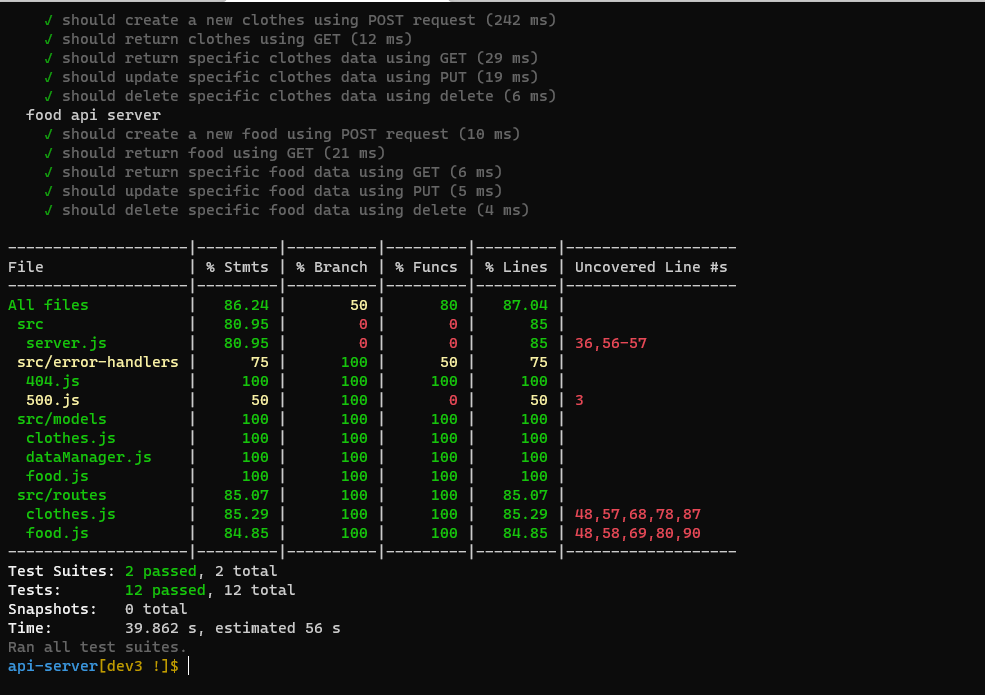

# api-server

## LAB - 04
## **Deployment Test**
## **Author: Tasnim Wheebi**
[PR LINK]()

[Heroku APP](https://tasnim-api-server.herokuapp.com)

[Report Test]()

## **Setup**
* .env requirements
  * PORT - 3000

## **Running the app**

* Endpoint: 

**npm start**

    * /api/v1/food : json object
   

          [

          {
           "_id": "60a65f8c4839a32019dd4857",
            "name": "strawberry",
            "type": "fruit",
            "__v": 0
            }

           ]

 * /api/v1/clothes : json object 

        [

          {
           "_id": "60a65f8c4839a32019dd4857",
            "name": "T-Shirt",
            "color": "red",
            "__v": 0
            }

           ]  

  * `/`
            
        Return Welcome to my web App

  * `/bad` 

          Something went wrong

  * `*`

        Page not found 404

**Test Image**

npm test

## **Tests**

* 404 on a bad route
* 404 on a bad method
* The correct status codes and returned data for each REST route
  * Create a record using POST
  * Read a list of records using GET
  * Read a record using GET
  * Update a record using PUT
  * Destroy a record using DELETE
  
  
## **UML**
